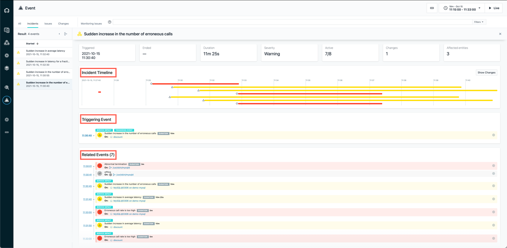
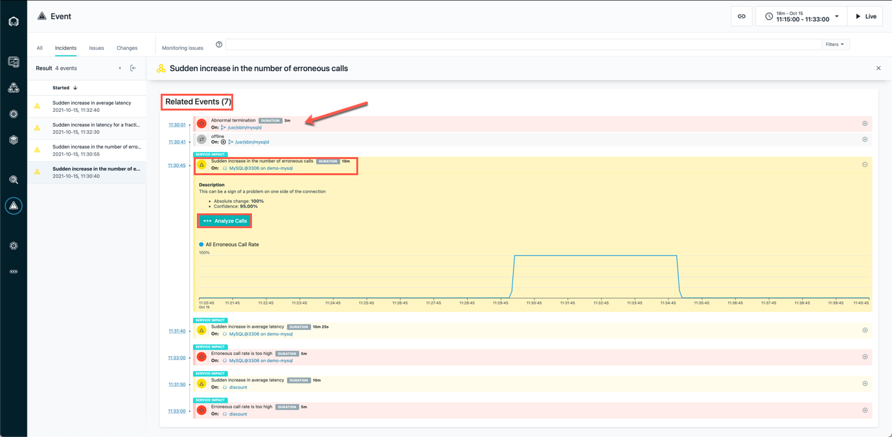
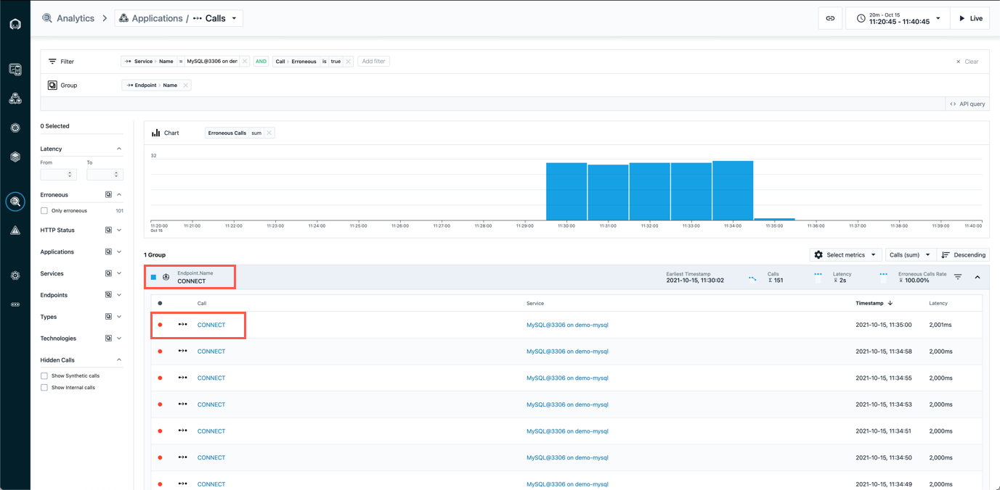
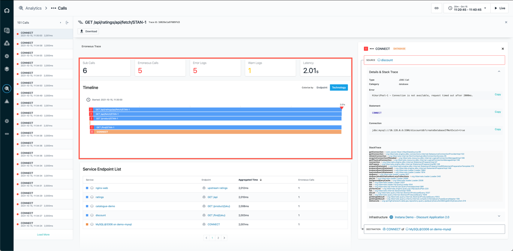
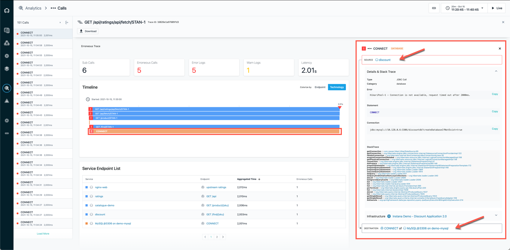
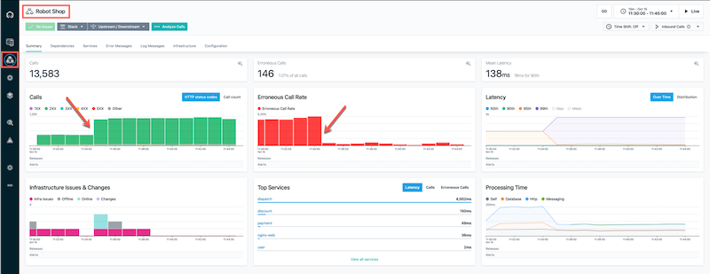

**NOTE**: The provided demo environment uses the Instana SaaS service, which follows the bi-weekly release schedule. This may result in minor differences between the screenshots in this guide and the actual environment you will see; however, in most cases, it will not impact the demo flow. In case you encounter significant differences please report in Slack support channel <a href="https://ibm-cloud.slack.com/archives/C0124J683GW" target="_blank" rel="noreferrer">#itz-techzone-support</a>.

To access the demo environment:

 - For IBMers, click <a href="https://ibmdemo-instanaibm.instana.io" target="_blank" rel="noreferrer">here</a>  
 - For business partners, click <a href="https://demo-partner.instana.io/" target="_blank" rel="noreferrer">here</a>

***

## Introduction

| **Starting point** |  |
| :---                   | :--- |
| **Actions**            | From the sidebar menu, click  **Applications**. Choose **Robot Shop.** |
| **Narration**          | In this demo, I will show how IBM Instana helps quickly identify, debug, and resolve an incident in a microservices-based application. 
 To set the context, our application is called Stan’s Robot Shop, and it is a modern, cloud-native application with microservices leveraging various technologies such as Java, Python, and MySQL and deployed in containers on top of Kubernetes cluster. 
 Such applications create a serious challenge for managing application performance because components are dynamic and loosely coupled. They use different technologies so usually require broad knowledge and multiple tools to diagnose. 
 Instana, with a single agent deployed per host, automates the discovery process. Application components are discovered and observed as they are deployed. Over 200 technologies are supported with zero or minimal configuration, releasing you from installing and configuring multiple tools or plugins. The discovered components can be grouped into an *Application perspective* giving the application owner an easy overview of key metrics ("golden signals") like *Traffic*, *Errors*, and *Latency* on a single pane of glass. |
| **Screenshot**         |    |

**[Go to top](#top)**

***

## 2. Context

| **2.1** |  **Automated discovery and dependency mapping** |
| :---                   | :--- |
| **Actions**            | Select the **Dependencies** tab. |
| **Narration**          | Context is the interrelated conditions in which something exists or occurs; context puts things into perspective. Understanding the context of the observability data is essential with modern distributed applications where there are extensive dependencies between components. 
 What you can see here is a visualization of all the dependencies within the Robot Shop application. Instana automatically discovered the relationships between the services and correlated them into this dynamic graph. This provides the necessary context to understand how different components affect each other. You can see how requests are moving through the application in real-time. Instana can do this because it tracks every request that flows through the application. 
  You can tell there are some problems with the application because several of the services are highlighted in yellow and red. But, you wouldn’t normally be looking at the dependency map when something like this happens, so let me walk you through what it looks like from the Site Reliability Engineer (SRE) or IT Operator’s point of view when an incident occurs. |
| **Screenshot**         |     |

**[Go to top](#top)**

***

## 3. Working with events and incidents

| **3.1** | **Automatically assessing events and alerts** |
| :---                   | :--- |
| **Action**             | Click the **Events** in the sidebar menu. |
| **Narration**          | There is an alert from Instana that there has been a sudden increase in erroneous calls on our ‘discount’ service, which is part of the robot shop application. 
 Although not connected to this demo, the alert would show up via one of the configurable alert channels, like Pager Duty, Microsoft Teams, Slack, and many others (<a href="https://www.instana.com/docs/events_alerts/alert-channels" target="_blank" rel="noreferrer">full list</a>). 
 It’s important to note here that you’re not getting alerts for just anything. Behind the scenes, Instana is determining which events and issues are related, and it only sends alerts on incidents if a problem is likely to affect end users. 
 Let’s go into the details of this incident. |
| **Screenshot**         |    |
 

| **3.2** | **Inspecting auto-correlated incident details** |
| :---                   | :--- |
| **Action**             | Click the incident called **Sudden increase in the number of erroneous calls** on the **'discount'** service. |
| **Narration**          | Instana recognized that the sudden increase in the number of erroneous calls was something important to alert on, so we did not have to do any configuration or set thresholds to get this alert. We get key information right away when we come into this incident detail page. There’s a timeline of the incident, the event that triggered Instana to create the incident, and all of the related events. |
| **Screenshots**        |    
 Incident details screen:    |

 

| **3.3** | **Understand the incident** |
| :---                   | :--- |
| **Actions**            | Under **Related Events**, click the event that says **Sudden increase in the number of erroneous calls**. In the end, click **Analyze Calls** button. |
| **Narration**          | It looks like the abnormal termination of the MySQL database caused the problem. It shows how one data store issue rippled out to affect several directly and indirectly connected services. Instana’s automatic root cause analysis uses the relationship information from the *Dynamic Graph* to accurately collate the individual issues into one incident. This helps eliminate alert storms, providing your DevOps engineers and SREs with a single notification of actionable information to enable them to promptly restore normal service. Let’s look at some related traces for this. |
| **Screenshot**         |    |

**[Go to top](#top)**

***

## 4. Unbounded Analytics

| **4.1** | **Examine call details** |
| :---                   | :--- |
| **Actions**            | Click the endpoint named **CONNECT**. Then, click the first call (also named **CONNECT**).|
| **Narration**          | Now, we moved to the Analytics view. You can see, how Instana UI allows for easy navigation between different views, keeping the time span and context. At the top, you can see the Filter that was applied to all collected traces. All filtered requests are grouped by endpoint [*In this case it is database CONNECT exposed my MySQL server*]. There is only one endpoint here, but if there were multiple, you’d see a list. Endpoints are automatically discovered and mapped by Instana. 
 You can go into the details for each erroneous call to MySQL via this endpoint (CONNECT). |
| **Screenshot**         |    |

 

| **4.2** | **View call via a visual dashboard** |
| :---                   | :--- |
| **Action**             | No action required. |
| **Narration**          | Clicking an individual call takes us to a view of the call in the context of the end-to-end trace. We can see where the request began () and each call that was made along the way. 
 Everything is presented in an easy-to-navigate visual dashboard, so we can drill into increasingly detailed information to pinpoint the problem, without using multiple tools or navigating back and forth to lots of dashboards. |
| **Screenshot**         |    |

 

| **4.3** | **Understand the impact and source of the incident** |
| :---                   | :--- |
| **Action**             | Click the span called **CONNECT** and refer to the sidebar on the right side. |
| **Narration**          | Clicking a span gives more details, including the source and destination as well as the full stack trace. In this case, you can see that the source is the ‘discount’ service, and [scroll down] the destination is CONNECT of MySQL. 
 So you can confirm that the root cause of the incident that affected the ‘discount’ service was with the MySQL database. The abnormal termination of the database caused a connection error, which then flowed back through the application. 
 When you bring MySQL back online, it will fix the problem. |
| **Screenshot**         |    |

**[Go to top](#top)**

## 5. Confirming incident resolution was successful

| **5.1** | **Metrics for the Robot Shop have returned to normal** |
| :---                   | :--- |
| **Actions**            | In the top-right corner set the timeframe so it begins at 30 minutes past the hour and ends at 45 minutes past the hour. Click **Set time**. 
 Navigate to **Applications** in the sidebar menu, choose **Robot Shop**, and select the **Summary** tab. 
 Note: You should see that the call volume has increased, the number of erroneous calls decreased, and latency also decreased.  |
| **Narration**          | Now that MySQL is working again, you can go back and confirm that the problems with the Robot Shop have been repaired. |
| **Screenshot**         |    |

**[Go to top](#top)**

***

## Summary

Now, you can see that the metrics for the Robot Shop have returned to normal: the call volume has increased again, the erroneous call rate, as well as latency, has dropped.

The problem with the Robot Shop has been fixed and the application's normal state was restored!

Hopefully, you’ve seen that Instana can help make the process of identifying problems and finding the root cause of those problems very frictionless. Since Instana automates so many of the manual and labor-intensive aspects of the process, you can focus on getting other work done and not worry about instrumenting observability or constantly monitoring for problems. And when problems do arise, all the trace data is there at your fingertips to dig into.

**[Go to top](#top)**

***

## Call to Action Guidelines

Successful demo should be closed with the **Call to Action** - getting the client to agree on the next steps that would progress the opportunity.

1. Create a slide or whiteboard to help the client outline the next steps. You could also use Mural or another whiteboarding platform. The goal is to let the client drive the conversation.

2. Proposed next steps may include:

   - a deep dive analysis of the client’s current APM to identify gaps and understand what the client is attempting to achieve. (Client drives this part along with the seller.)
   - Instana SaaS trial or Proof-of-Concept if warranted.

3. The output of the analysis is a solution brief that is co-authored with the client. The solution brief outlines the problem and Instana’s projected solution.

4. Instana’s technical team follows up after the solution brief is completed. They will have a better view of the projected solution. This drives a mutual closing plan with a pricing agreement.

5. The ultimate goal is product launch at the client.

**[Go to top](#top)**