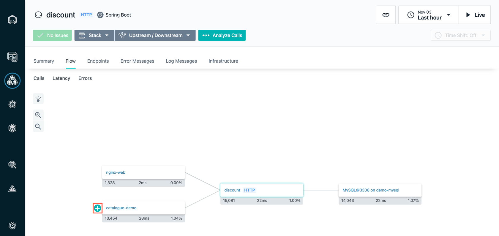
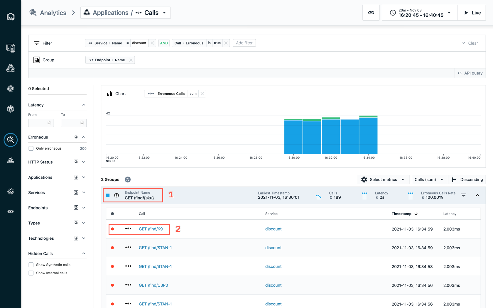

**NOTE**: The provided demo environment uses the Instana SaaS service, which follows the bi-weekly release schedule. This may result in minor differences between the screenshots in this guide and the actual environment you will see; however, in most cases, it will not impact the demo flow. In case you encounter significant differences please report in Slack support channel <a href="https://ibm-cloud.slack.com/archives/C0124J683GW" target="_blank" rel="noreferrer">#itz-techzone-support</a>.

To access the demo environment:

 - For IBMers, click <a href="https://ibmdemo-instanaibm.instana.io" target="_blank" rel="noreferrer">here</a>  
 - For business partners, click <a href="https://demo-partner.instana.io/" target="_blank" rel="noreferrer">here</a>

***

## Introduction

To set the context, this demo shows a sample day-in-life of the Site Reliability Engineer (SRE). At the start of the shift, SRE gets notified that one of the application services named `discount` misbehaves. SRE is not familiar with this service or application but the task is to find out what's wrong and Instana provides the means to achieve it.

### Starting point

   |||
   | :---                   | :--- |
   | **Actions**            | From the sidebar menu, click  **Infrastructure**. |
   | **Narration**          | In this demo, I will show you a quick overview of Instana’s Enterprise Observability Platform. 
 Instana automates observability, with a single agent per host, application components are discovered and observed as they are deployed. Over 200 technologies are supported with zero or minimal configuration, releasing you from installing and configuring multiple plugins. 
 Instana’s automation frees up valuable engineering time and ensures code is instrumented to a common standard. |
   | **Screenshot**         |       |

**[Go to top](#top)**

***

## 1. Infrastructure map

### 1.1 Exploring the infrastructure map

   |||
   | :---                   | :--- |
   | **Actions**            | Enter  **discount** in the Search Bar (1). Zoom the view using the **'+'** sign in the bottom-right corner (2). |
   | **Narration**          | As well as metrics, logs and traces, Instana automatically indexes entity metadata such as: container labels, Kubernetes deployment labels and application framework names. This makes it easy to find any component, for example the discount service.|
   | **Screenshot**         |     |

 

### 1.2 Drilling into the host

   |||
   | :---                   | :--- |
   | **Actions**            | Click the light gray box representing the Linux host (1). Click **Open dashboard** button (2). |
   | **Narration**          | Drilling into this host shows its metadata in the left panel and the time series metrics on the right. |
   | **Screenshot**         |       |

 

### 1.3 Adjusting the time range 

   |||
   | :---                   | :--- |
   | **Actions**            | Click the time range dropdown (1). Click **Last minute** button (2) and **Live** button (3). After awhile, when the graphs refresh with 1-second granularity, set the time range back to **Last hour** |
   | **Narration**          | Instana streams 1 second resolution metrics in real time. |
   | **Screenshot**         |    |

**[Go to top](#top)**

***

## 2. Exploring *Context Guide*

| **2.1** |  **Exploring context information discovered by Instana** |
| :---                   | :--- |
| **Actions**            | Click the **Stack** (1) dropdown (known as *Context Guide*). Briefly show different tabs (**Infrastructure** (2), **Kubernetes** (3), and **Applications** (4)). Finally, click **discount** service (5). |
| **Narration**          | Context is the interrelated conditions in which something exists or occurs; context puts things into perspective. Understanding the context of the observability data is essential with modern distributed applications where there are extensive dependencies between components. 
 As well as automatically discovering application components, Instana’s unique *Dynamic Graph* continually discovers entity relationships over time, therefore at any point in time Instana knows what was talking to what and where it was running. Adding the most important element of observability data, metric, logs, traces and context. 
 The *Dynamic Graph* is accessible via the context guide. This shows that this host is running a number of services, including the discount service, that you searched for earlier.|
| **Screenshot**         |    |

 

| **2.2** |  **Exploring service dashboard** |
| :---                   | :--- |
| **Actions**            | Select **Summary** tab if not selected by default. At the end, select **Flow** tab. |
| **Narration**          | The summary tab for the discount service shows the key performance indicators of Rate, Errors and Duration. Instana traces every request end to end without sampling. The traces are analysed in real time to provide these metrics, making any performance problems immediately visible.|
| **Screenshot**         |    |

 

| **2.3** |  **Exploring flow information** |
| :---                   | :--- |
| **Actions**            | Click  signs next to service names in the graph to reveal more connections. At the end, select **Endpoints** tab. |
| **Narration**          | The flow tab shows the immediate upstream and downstream services. A visualisation of Instana’s unique *Dynamic Graph*. |
| **Screenshot**         |    
 |

 

| **2.4** |  **Exploring endpoints list** |
| :---                   | :--- |
| **Actions**            | Click the first endpoint in the list (usually it is **GET /find/{sku}**) |
| **Narration**          | The endpoints tab shows all the endpoints provided by the service. These are all automatically detected with zero configuration. |
| **Screenshot**         |   |

 

| **2.5** |  **Exploring endpoint details** |
| :---                   | :--- |
| **Actions**            | Select **Log Messages** tab. [ If you cannot see any log entries, make sure that you set the time range back to Last Hour. ] |
| **Narration**          | Selecting an endpoint provides the key performance indicators for that endpoint. Being able to view detailed information for individual endpoints helps with identifying performance problems by narrowing the scope. 
 Instana automatically collects log messages at WARN and above. The messages show that there have been some issues connecting to the database. |
| **Screenshot**         |   |

 

| **2.6** |  **More context exploration** |
| :---                   | :--- |
| **Actions**            | Click **Stacks** dropdown and select **Kubernetes** tab. Click **robot-shop/dicount (deployment)**. In the deployment dashboard select **Details** tab. Explore available data, such as Labels, Annotations, etc.   |
| **Narration**          | However, before you investigate further, the Context Guide again shows that this service is deployed on Kubernetes. 
 The deployment summary shows resource allocation and pod state. 
 The deployment details provides a preview of the YAML. |
| **Screenshot**         |   |

 

| **2.7** |  **More context exploration (continued)** |
| :---                   | :--- |
| **Actions**            | Click **Stacks** dropdown and select **Kubernetes** tab. Click **robot-shop (namespace)**. Explore available data, selecting different tabs.   |
| **Narration**          | The Context Guide shows that this deployment is in the *robot shop* namespace. 
 The namespace summary shows resource allocation and pod state. 
 The deployments tab lists the other deployments in this namespace. So far you have seen metrics, logs and context. What about traces? Remember the discount service had some database connection issues? Let’s investigate that.|
| **Screenshot**         |   |

**[Go to top](#top)**

***

## 3. Working with events and incidents

| **3.1** | **Automatically assessing events and alerts** |
| :---                   | :--- |
| **Action**             | Click **Events** in the sidebar menu. |
| **Narration**          | Instana processes observability data in real time with 1 second resolution on metrics and every request traced, no sampling. All the data, all the time. High fidelity data with a curated knowledgebase of health signatures ensures that you’re immediately informed of any performance incidents. 
  |
| **Screenshot**         |    |
 

| **3.2** | **Inspecting auto-correlated incident details** |
| :---                   | :--- |
| **Action**             | Click the incident called **Sudden increase in the number of erroneous calls** on the **discount** service. |
| **Narration**          | The incident on the discount service shows how one data store issue rippled out to affect a number of directly and indirectly connected services. Instana’s automatic root cause analysis uses the relationship information from the *Dynamic Graph* to accurately collate the individual issues into one incident. This completely eliminates alert storms and provides your DevOps engineers and SREs with a single notification of actionable information to enable them to promptly restore normal service. |
| **Screenshots**        |    |

 

| **3.3** | **Understanding the incident** |
| :---                   | :--- |
| **Actions**            | Expand the **Triggering Event**. Scroll down. Click **Analyze Calls**. |
| **Narration**          | Looking at the issue that triggered the incident shows that the error rate suddenly changed for the worse. The sudden change or rising edge of the error rate is automatically detected by Instana, no need to manually configure and maintain thresholds. 
 Scrolling down through the timeline of related events provides a chronological playback of how one issue rolled out across the application, ultimately triggering the incident. 
 The abnormal termination of the MySQL process was the root cause. Once the database is brought back online, all the other issues will disappear. 
 Let’s look at some related traces for this. |
| **Screenshot**         |      |

**[Go to top](#top)**

***

## 4. Unbounded Analytics

| **4.1** | **Examine call details** |
| :---                   | :--- |
| **Actions**            | Click the endpoint named **GET /find/{sku}**. Click the first failed call (also named **CONNECT**).|
| **Narration**          | Looking at all the erroneous calls to the discount service, shows that they all take about 2 seconds, indicating a possible timeout situation.  |
| **Screenshot**         |    |

 

| **4.2** | **View call detils  dashboard** |
| :---                   | :--- |
| **Action**             | Explore the view expanding the sections indicated in the narration. |
| **Narration**          | Looking at a trace detail shows how the error, indicated by the red triangle (1), propagated up the call stack, ultimately giving the user a 500 error (2). 
 The right hand panel shows low level detail, including the call stack (3). 
 Expanding the infrastructure detail (4) shows the application component stack. 
 Expanding the profiling detail (5)shows a preview of Instana’s always on production profiling data. 
 Expanding the logs detail (6) shows the messages and call stack, with a preview of the source code (7). |
| **Screenshot**         |    |

**[Go to top](#top)**

## 5. Application dashboards

| **5.1** | **Exploring Application perspectives and dashboards** |
| :---                   | :--- |
| **Actions**            |  Navigate to **INSTANA** (1) in the sidebar menu, click the dropdown (2) and choose **Robot Shop** (3).  |
| **Narration**          | Now that you covered the requirements for DevOps and SRE, how about the application owners? Instana’s built in custom dashboards provide application owners with a top level view of user experience and application performance. |
| **Screenshot**         |    |

**[Go to top](#top)**

***

## Summary

Instana Enterprise Observability equips you to find answers to questions you didn’t know you needed to ask. It takes you beyond looking for problems to finding answers. 

Enterprise Observability adds automation, speeding up implementation and reducing ongoing maintenance plus ensuring all services are instrumented to the same standard. Automation accelerates time to value. 

Enterprise Observability is more than just data, it adds context. Which brings understanding to complex distributed applications, enabling you to do more with the data. 

Metrics, logs and traces are automatically processed in real time turning data into contextual information, enabling you to take intelligent action to keep your services running optimally and your customers happy.

**[Go to top](#top)**

***

## Call to Action Guidelines

A successful demo should be closed with the **Call to Action** - getting the client to agree on the next steps that would progress the opportunity.

1. Create a slide or whiteboard to help the client outline the next steps. You could also use Mural or another whiteboarding platform. The goal is to let the client drive the conversation.

2. Proposed next steps may include:

   - a deep dive analysis of the client’s current APM to identify gaps and understand what the client is attempting to achieve. (Client drives this part along with the seller.)
   - Instana SaaS trial or Proof-of-Concept if warranted.

3. The output of the analysis is a solution brief that is co-authored with the client. The solution brief outlines the problem and Instana’s projected solution.

4. Instana’s technical team follows up after the solution brief is completed. They will have a better view of the projected solution. This drives a mutual closing plan with a pricing agreement.

5. The ultimate goal is product launch at the client.

**[Go to top](#top)**